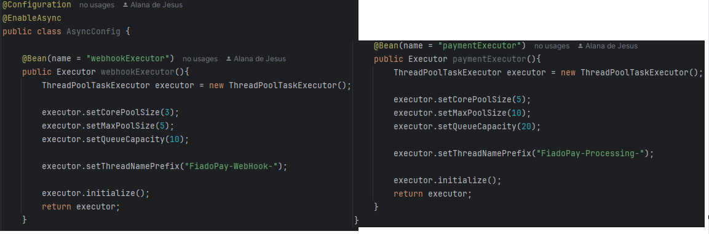
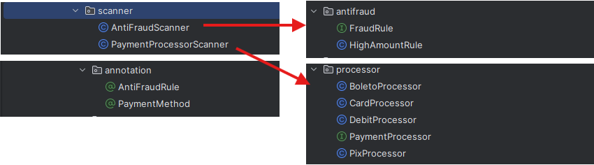
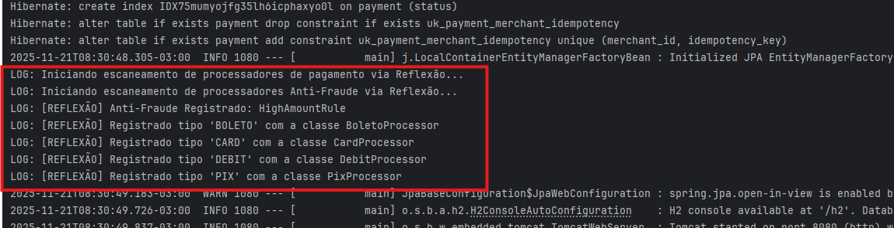
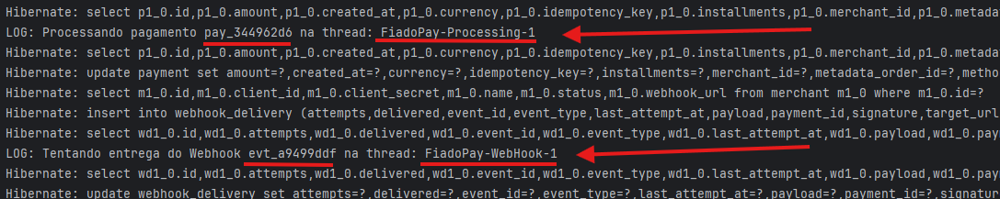
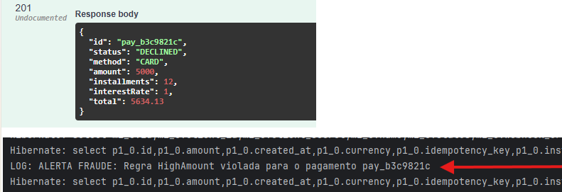
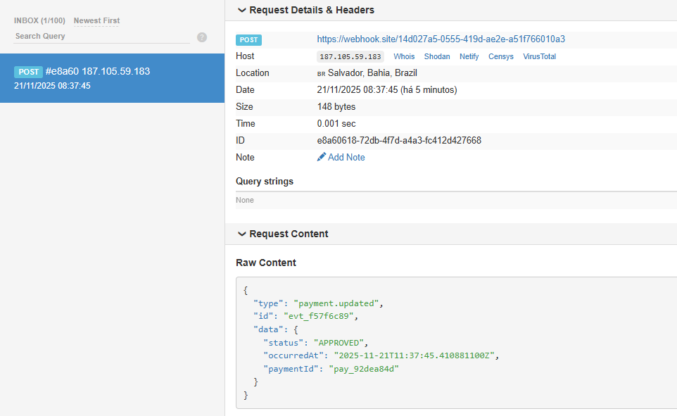

# FiadoPay - Refatoração de Gateway de Pagamentos

**Disciplina:** Engenharia de Software / Programação Orientada a Objetos Avançada
**Status:** Refatorado (Versão 2.0)

**Alunos:**

- **_LUCAS DE ALMEIDA BORGES_**;
- **_JOAO MARCELO DIAS DE JESUS_**;
- **_ALANA DE JESUS COSTA SANTOS_**;
- **_FILIPE SANTOS RODRIGUES DE JESUS_**;
- **_EDUARDO ALEXANDRE DE SOUZA BARBOSA_**;
- **_KAYKE PEREIRA CARVALHO QUEIROZ_**;

---

## Sobre o Projeto

O **FiadoPay** é uma API que simula um gateway de pagamentos, lidando com transações (Cartão, Pix, Boleto, Débito), cálculo de juros, validação de fraudes e notificações via Webhooks.

O objetivo deste projeto não foi o desenvolvimento funcional do zero, mas sim a refatoração de um código "legado". A versão original apresentava alto acoplamento, baixa coesão ("God Class") e uso inadequado de recursos de sistema. A versão atual aplica conceitos avançados de Engenharia de Software, garantindo extensibilidade, manutenibilidade e resiliência.

---

## Diagnóstico e Decisões de Design Arquitetural


### 1. Do Monolito à Segregação (SRP)

A análise inicial identificou a classe `PaymentService.java` como uma **God Class** (Classe Divina), acumulando mais de 10 responsabilidades distintas (Auth, Juros, Webhooks, Retry, Persistência). Isso violava o Princípio da Responsabilidade Única (SRP).

**Decisão de Refatoração:**
O serviço monolítico foi decomposto em componentes especialistas, desacoplando a lógica de negócio da infraestrutura:

| Serviço / Componente           | Responsabilidade Única (SRP)                                                                                  |
| :----------------------------- | :------------------------------------------------------------------------------------------------------------ |
| **`PaymentService`**           | **Orquestração:** Apenas coordena o fluxo, delega tarefas e gerencia o ciclo de vida da transação.            |
| **`MerchantService`**          | **Segurança:** Centraliza a autenticação e validação de lojistas, removendo essa carga do fluxo de pagamento. |
| **`InstallmentService`**       | **Regra de Negócio:** Especialista no cálculo financeiro de juros compostos.                                  |
| **`PaymentProcessingService`** | **Infraestrutura:** Gerencia a simulação de latência bancária de forma assíncrona.                            |
| **`WebhookDeliveryService`**   | **Comunicação:** Orquestra a criação, assinatura e persistência de notificações.                              |

### 2. Refatoração da Camada de Controle (Facade)

Os Controllers (`AuthController`, `MerchantAdminController`) acessavam diretamente os Repositórios (JPA), criando um acoplamento indevido entre a camada Web e a camada de Dados.

- **Solução:** Implementação de uma camada de serviço intermediária (`MerchantService`), garantindo que os Controllers atuem apenas como _Facades_ (recebem DTOs, chamam serviços, retornam Status HTTP).

---

## Threads e Concorrência (Engenharia de Resiliência)

O requisito de processamento assíncrono foi implementado utilizando o `ExecutorService` do Spring Framework, com uma arquitetura pensada para tolerância a falhas.

### Padrão Bulkhead (Segregação de Pools)

Em vez de utilizar um único pool de threads para toda a aplicação, aplicamos o padrão **Bulkhead** no `AsyncConfig.java`, criando isolamento de recursos:

1.  **`paymentExecutor`**: Pool dedicado ao processamento "Core" (regras de negócio, banco de dados).
2.  **`webhookExecutor`**: Pool dedicado a operações de I/O externas (envio HTTP).

**Justificativa de Engenharia:** Essa separação isola falhas. Se o serviço externo receptor de webhooks ficar indisponível ou lento (causando bloqueio de threads), isso não afetará a capacidade da API de processar novos pagamentos. Evita-se assim o _Thread Starvation_ no fluxo principal de negócio.



### O Padrão "Async Agent"

Para resolver a limitação técnica do Spring onde chamadas `@Async` dentro da mesma classe não funcionam (devido ao mecanismo de Proxy), implementamos o componente `WebhookAsyncAgent`.

- **Fluxo:** `PaymentService` (Sync) → `ProcessingService` (Async) → `WebhookDeliveryService` (Sync) → `WebhookAsyncAgent` (Async).

---

## Metaprogramação: Anotações e Reflexão

Para garantir a extensibilidade do sistema e aderência ao princípio **Open/Closed (SOLID)** — _aberto para extensão, fechado para modificação_ — substituímos estruturas condicionais rígidas (`if/else`) por descoberta dinâmica de componentes.

### 1. Anotações Customizadas Criadas

| Anotação             | Alvo   | Metadados                               | Descrição                                                                                 |
| :------------------- | :----- | :-------------------------------------- | :---------------------------------------------------------------------------------------- |
| **`@PaymentMethod`** | Classe | `type` (String)                         | Marca uma classe como estratégia de processamento para um meio de pagamento (ex: "CARD"). |
| **`@AntiFraudRule`** | Classe | `name` (String)<br>`threshold` (double) | Marca uma classe como uma regra de validação de fraude ativa no sistema.                  |

### 2. Mecanismo de Reflexão (Scanners)

Desenvolvemos componentes que utilizam o `ApplicationContext` do Spring para inspecionar o código em tempo de execução (Runtime).

- **`PaymentProcessorScanner` (Padrão Strategy):**

  - Varre o contexto em busca de beans que implementam `PaymentProcessor`.
  - Lê a anotação `@PaymentMethod` e mapeia a estratégia (ex: `CARD` -> `CardProcessor`).
  - **Resultado:** O `PaymentService` não conhece as implementações concretas, apenas solicita a estratégia correta ao Scanner.

- **`AntiFraudScanner` (Padrão Chain/Filter):**
  - Identifica automaticamente novas regras de fraude anotadas com `@AntiFraudRule`.
  - Disponibiliza a lista de regras para o `CardProcessor`.
  - **Resultado:** Para criar uma nova regra de fraude, basta criar uma classe Java. Não é necessário alterar nenhuma linha de código existente no sistema.

## 

## Padrões de Projeto Aplicados (GoF & Enterprise)

A refatoração foi guiada por padrões de projeto estabelecidos:

1.  **Strategy:** Utilizado na seleção do processador de pagamento (`PaymentProcessor`).
2.  **Chain of Responsibility / Filter:** Utilizado no sistema Anti-Fraude (`AntiFraudScanner`).
3.  **Facade:** Aplicado nos Controllers para simplificar a interface de entrada da API.
4.  **Proxy:** Utilizado implicitamente pelo Spring para gerenciar as transações e assincronicidade.
5.  **Repository:** Abstração da camada de acesso a dados (Spring Data JPA).
6.  **Dependency Injection (DI):** Inversão de controle utilizada para desacoplamento total.

---

## Limites Conhecidos

Este projeto possui escopo acadêmico e apresenta as seguintes limitações propositais:

- **Persistência Volátil:** Utiliza banco de dados H2 em memória; os dados são perdidos ao reiniciar.
- **Simulação:** A latência bancária e a aprovação/recusa de pagamentos são simuladas via algoritmos aleatórios (`Math.random`), sem integração real com adquirentes.
- **Segurança:** O token Bearer é validado apenas por formato e existência no banco, sem criptografia real (JWT).
- **Concorrência Estática:** Os _pools_ de threads possuem capacidades fixas (`paymentExecutor`: máx 10, `webhookExecutor`: máx 5) e filas limitadas. Em um cenário de produção com alta carga, isso exigiria configuração dinâmica ou escalabilidade horizontal para evitar rejeição de tarefas.

## Instruções de Inicialização

### Pré-requisitos

- Java 21+, Maven/Gradle.

### Passo a Passo

1. **Iniciar a API FiadoPay (Aplicação Principal):**
   Em um terminal, na raiz do projeto:

   ```bash
   ./mvnw spring-boot:run
   ```

2. **Testar a Aplicação:**
   A API estará disponível em `http://localhost:8080`.
   - Swagger UI: `http://localhost:8080/swagger-ui.html`
   - Console H2: `http://localhost:8080/h2` (JDBC URL: `jdbc:h2:mem:fiadopay`)
   - URL do site para visualização do envio do Webhook: `https://webhook.site/#!/view/14d027a5-0555-419d-ae2e-a51f766010a3`
   - webhookUrl (utilizada para o cadastro do Merchant): `https://webhook.site/14d027a5-0555-419d-ae2e-a51f766010a3`

## Fluxo

1. **Cadastrar merchant**

```bash
curl -X POST http://localhost:8080/fiadopay/admin/merchants   -H "Content-Type: application/json"   -d '{"name":"MinhaLoja ADS","webhookUrl":"https://webhook.site/14d027a5-0555-419d-ae2e-a51f766010a3"}'
```

2. **Obter token**

```bash
curl -X POST http://localhost:8080/fiadopay/auth/token   -H "Content-Type: application/json"   -d '{"client_id":"<clientId>","client_secret":"<clientSecret>"}'
```

3. **Criar pagamento**

```bash
curl -X POST http://localhost:8080/fiadopay/gateway/payments   -H "Authorization: Bearer FAKE-<merchantId>"   -H "Idempotency-Key: 550e8400-e29b-41d4-a716-446655440000"   -H "Content-Type: application/json"   -d '{"method":"CARD","currency":"BRL","amount":250.50,"installments":12,"metadataOrderId":"ORD-123"}'
```

4. **Consultar pagamento**

```bash
curl http://localhost:8080/fiadopay/gateway/payments/<paymentId>
```

---

## Evidências de Execução

### 1. Inicialização e Reflexão

_O log demonstra os Scanners encontrando e registrando as estratégias e regras dinamicamente no startup._

> ****

### 2. Concorrência e Threads

_Demonstração do processamento ocorrendo em threads distintas da thread HTTP principal (`http-nio`)._



### 3. Validação Anti-Fraude

_Demonstração da regra `HighAmountRule` bloqueando uma transação de alto valor._



### 4. Integração de Webhook

_Demonstração do webhook.site externo recebendo a notificação._


